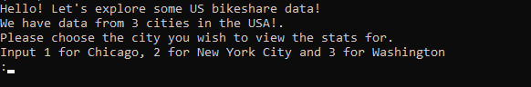
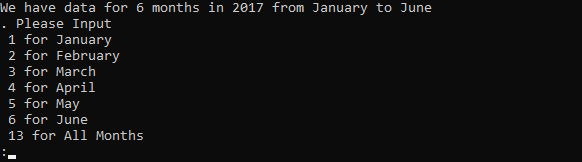
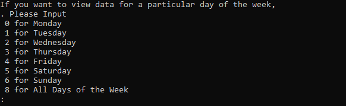
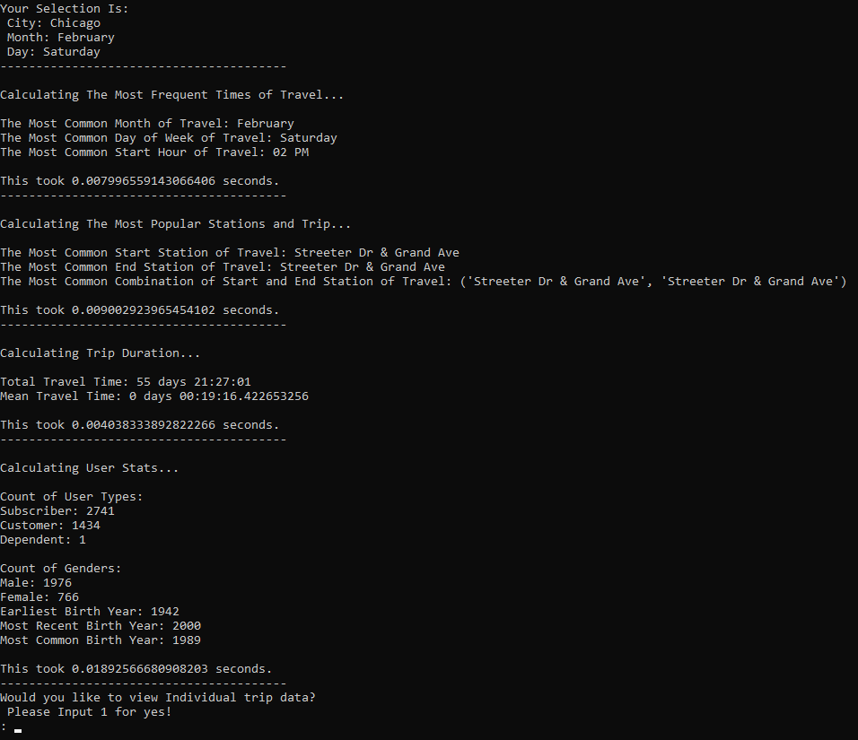
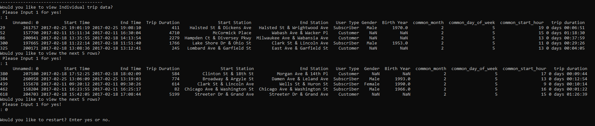

### Date created: 21st July 2022

### Project Title: US Bikeshare Exploration for Data Science Nano Degree


### Description:
In this project, 3 cities' bikeshare data are made available by Udacity team.
The cities are:
- Chicago
- New York City
- Washington

The data files are in csv format and are cleaned for easy usage.

The steps to execute the script.
Once the bikeshare.py script is executed, the script would do the following.
- The user is prompted for selecting a city from which they want to view the bike share statistics

- The user is then prompted for selecting the month in 2017 that they want to view the bike share statistics

- The user is then prompted for selecting the day of the week that they want to view the bike share statistics

- After the user has made their selection, the statistics for the selected options are evaluated and displayed

- As an additional feature, the user is prompted to choose if they want to view raw data in rows of 5


### Files used
```
└── docs

    └── images
 	
	       └── 1stPrompt.png 
 	
	       └── 2ndPrompt.png
 	
	       └── 3rdPrompt.png 
 	
	       └── FinalPrompt.png
 	
	       └── Outcome.png 

└── bikeshare.py

└── readme.md
 ```

### Credits
I referred the following sites whenever in doubt:
https://pynative.com/
https://www.geeksforgeeks.org/
https://www.w3schools.com/
https://stackoverflow.com/
